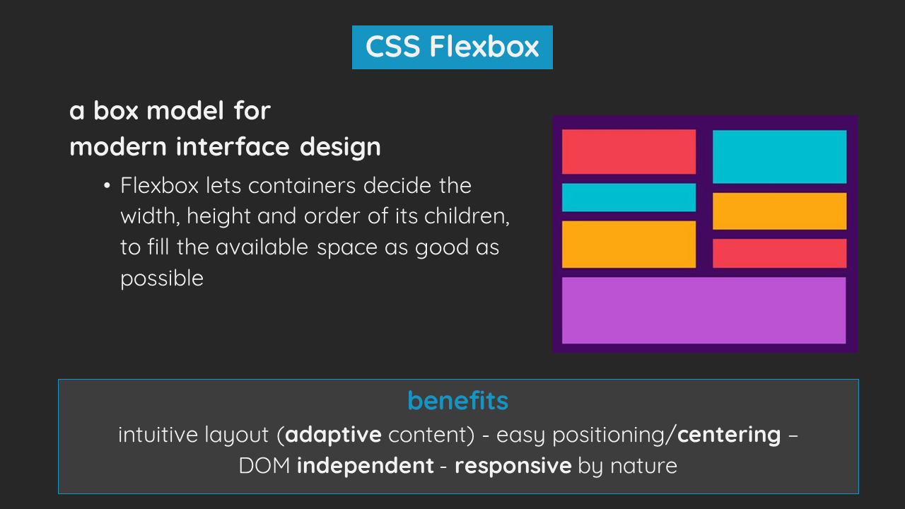
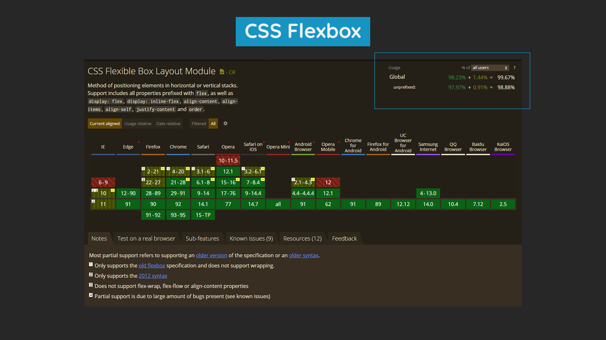
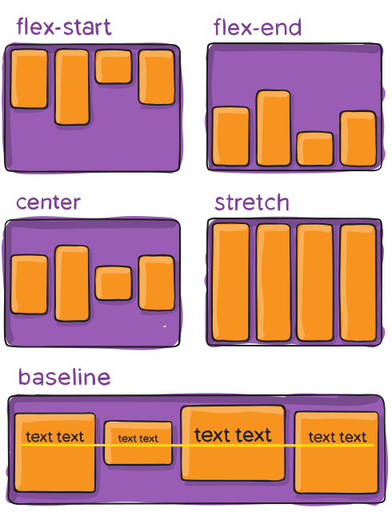
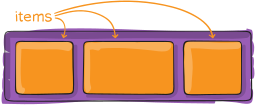

# Better styling with CSS Flexbox and LESS

## 1) Introduction

- **CSS has been around for almost 30 years (since 1994)**

  - Most people learned how to style properly many years ago / without learning the best practices
  - Since then, a lot of new features have been added
  - Many "CSS fixes" are now outdated and should be avoided

- **Many developers "hate" CSS**
  - _Why?_
    - The learning process and documentation (like questions on stackoverflow) are inconsistent, confusing and counterintuitive
  - _Result: "Cycle of Bad Code"_
    - "Spaghetti code" using many bad practices
    - This code is hard to understand, maintain and collaborate on
    - Result: instead of refactoring existing code, it will be overwritten with even more bad practices

- **Harry Roberts**
  - He illustrates in his quote that most CSS issues are caused by a **lack of confidence**
  - CSS's globally and leaky nature makes us fear the concequences
  - Knowing more about **_CSS specificity_**, best practices and generally how CSS works, will give us the freedom we need for creating **organised**, **scalable** and **easy to debug** styling systems

- **Good styling practices will make CSS:**
  - Predictable
  - Less abstract
  - Organised
  - Scalable
  - In short: everything developers love!

## 2) Table of Contents

- **In this presentation we will discuss:**
  - General tips
  - Typical mistakes and bad practices
  - How to use Block Element Modifier (BEM) naming conventions for more consistency
  - How to use CSS flexbox
  - Basic SASS concepts
- **Live exercise**
  - After the presentation, we will practice the principles by styling a basic layout using principles of BEM, CSS Flexbox and SASS.
  - 15-30 minutes of preperation time
  - 15 minutes of going over a possible solution (live coding)
- **Resources and feedback**
  - At the end of the workshop, we will share some useful guides, documentation and other resources
  - Feedback: questionnarie on Teams

## 3) Terminology

- We will use some basic terminology:
  - **DOM Element**
    - The DOM Element object represents an HTML element, like p, div, a, table, or any other HTML tag
  - **CSS Selector**
    - a string used to "find" (or select) the HTML elements you want to style
  - **CSS Rules**
    - a grouping of one or more CSS properties which are to be applied to one or more target DOM elements - a CSS rule consists of a _CSS selector_ and a _set of CSS properties_.
  - **CSS Preprocessor**
    - a program that lets you generate CSS from the preprocessor's own unique syntax
  - **SASS/LESS**
    - examples of popular CSS preprocessors

## 4) General tips

- **Try, refactor, continue**
  - When you are writing styling rules, you will most likely have to try out multiple rules until it does what you want
  - Like this, stylesheets can get extremely long
  - After you made something work, try to remove each line of code that is not necessary
- **Keep your CSS readable**
  - ADD TEXT HERE
  - Complicated selectors: add a comment
- **Keep your CSS organized**
  - Write title comments for each section:
    - Global / typography / layout / components
- **Reuse**
  - Not all css code is very understandable by itself
  - For example, to create a dropdown you will have to put the parent in position relative, the child position absolute with a top of 100%, etc.
  - This code by itself is very abstract and can't be read without understanding the underlying priniciples
  - Use preprocessors to create helper mixins (similar to functions) that are scalable (arguments) and make your main code tons more readable
  - Create yourself a "CSS Helpers library" so you can reuse the same techniques over multiple projects

## 5) Typical mistakes

- **`!important` rules**

  - _Mistake:_
    - developers use these rules to overwrite previously written code
  - _Solutions:_
    - Use proper [specificity](https://css-tricks.com/specifics-on-css-specificity/ "Specifics on CSS Specificity")
      > **_Specificity_** is the means by which browsers decide which CSS property values are the most relevant to an element and, therefore, will be applied. Specificity is based on the matching rules which are composed of different sorts of CSS selectors.
      > 
    - **Specific rules:** Create your selectors specific enough so that they are harder to get overwritten by older rules
    - **General rules:** Create them less specific so they are easier to overwrite later on
    - Use **front-end frameworks** such as react to create unique classes that never get overwritten by other code
    - or simply find the source file back where your rule is written, discover why it was written, and refactor it in a way that the old styling still works, but yours doesn't get overwritten
  - _Exceptions_:
    - in examples where you know elements with a particular class selector should use a certain set of styling no matter what
    - to make a classname super robust and not easily trifled with
      - See BEM

- **Fixed widths/heights in pixels or use of calc-statements and percentages for lay-out**

  - _Mistake:_
    - Fixed widths or heights are often used all over the project. When content changes, code has to change.
    - Similarly, also percentages or calc-statements are often used to define lay-out
  - _Solutions:_
    - Use alternative box models such as **flexbox** or **grid**
  - _Exceptions:_
    - Design elements without any content such as icons, avatars, before elements, etc, can have a fixed amount of pixels.
    - In some multi-column layouts some columns can have a fixed width

- **Using meaningless DOM elements such as wrappers, linebreaks, empty spans or divs**

  - _Mistake:_
    - Meaningless DOM elements such as multiple wrappers, linkebreaks and empty spans or divs are used to create styling artefacts within the DOM. This is bad because we want to keep the **seperation of semantics and style** preseved
  - _Solutions:_
    - Reorganize code so that styling is less complex
    - Use modifier classes (see BEM)
  - _Exceptions:_
    - Use only when there is no pure-CSS solution possible

- **Inconsistent spacing**
  - _Mistake:_
    - every nested container has their own paddings and margins -> result: spacing between elements isn't consistent or easy to change because it is a sum of different spacings
  - _Solutions:_
    - Define paddings of design elements in the design phase
    - General rule: Keep padding/margin on the first possible element

## 6) BEM: Block, Element, Modifier

- **BEM is a methodology and naming convention**

  - BEM (Block, Element, Modifier) is a component-based approach to web development. The idea behind it is to divide the user interface into independent blocks. This makes interface development easy and fast even with a complex UI, and it allows reuse of existing code without copying and pasting.

- **Benefits**
  - Consistency in classnames
  - Avoiding overwrites and confusion
  - Creation of a modular and expandable html / css system
  - Easier collaboration

- **It defines 3 different concepts:**
  - _Block_
    - a top-level abstraction of a new component
      - in the UI example, the `card`, `listitem`, as well as the `button` are examples of blocks. Their styling is independent of where it will be found in the page.
  - _Element_
    - a child of a block – its styles are dependant on their parent
      - in the UI example, the `card__title`, `card__list` as well as the `listitem__title`, `__subtitle` and `__avatar` are examples of elements. Their styling is dependant on their parent, the block.
  - _Modifier_
    - a variation / state of an element or block
      - in the UI example, `listitem--active` and `button--text_only`, are examples of modifiers. They are variations of a box or element.

## 7) CSS Flexbox

- **CSS Flexbox is the most useful box model for modern interface design**
  - It lets containers decide the width, height and order of its children, to fill the available space as good as possible
- **Benefits**
  - _Intuitive layout creation_ - Allows you to create modern layouts in an intuitive way
    - Avoids "fixes" and "ugly code" such as width/height percentages, calc statements, outdated properties such as float
  - _Easy positioning and centering_ - No need for defining widths or heights
  - _DOM independent_
    - DOM content and order is independent to the way it is styled --> additional benefit: accessibility (screen readers, alt text)
    - This is good for separation of semantics and style
      - No need for meaningless DOM separators, wrappers, etc
  - _Inherently responsive_ - There are not as many mediaqueries necessary as with classic box models. - Especially when setting the flex-wrap to wrap, most repositioning will happen automatically (without any mediaqueries)
    - Easy mediaquery: change flex-direction from row to column for mobile layout

- **Browser support**
  - A reason why many developers aren't using flexbox, is because they believe it has poor browser compatibility.
  - However, already **98.9%** of all devices fully support flexbox, and **99.6%** supports the basic features.
  - Unless your application has a heavy userbase using internet explorer, there is no reason to not use flexbox.

- **Flexbox properties**

  - We will now go over the flexbox properties that I personally use most.
  - _Parent_

    - The parent is the container whose children you want to align.

        

      - **The most important properties are:**

        - `display`

          - The `display` property can be set to `flex` or `inline-flex`. This decides if the parent container should behave as a `block` element or an `inline-block` element in its environment.

        - `flex-flow`

          - The `flex-flow` property is a shorthand for `flex-direction` and `flex-flow`.

            
            

          - The `flex-direction` decides the direction of the main axis in which the children will be placed (default: `row`). The most commonly used values are `row` and `column`.
          - The `flex-wrap` decides if elements can take up multiple rows or columns. `nowrap` is generally used for general layout functionality, while `wrap` is generally used for lists.
          - The combination I use most is `flex-flow: row nowrap` which is also the default value.

        - `align-items`

          - The `align-items` property defines how the children should be aligned on the main axis (for `flex-direction: row` that means vertical alignment, for `flex-direction: column` that means horizontal alignment).

            

          - The values I use most are `center`, `flex-start` (default) and `stretch`(used for creating boxes of equal size with various content).

        - `justify-content`

          - The `justify-content` property defines what should be done with the space left after all elements have reached their maximum size (defined by the `flex` property of the children), or in other words, how the children should be positioned inside of their parent container.

            

          - The values I use most are `center`, `flex-start` (default) and `space-between`.

  - _Child_

    - The child items refer to all direct children of the flex container.

        

    - the `.parent > \**` selector can be used to select all flex children of a flex parent.
    - **_important:_** the flex parent can only position first-level (direct) children
      - It often happens that there are multiple wrappers, then it is important to realise that only the deepest level wrapper should have `display: flex` .
    - **The most important properties are:**

      - `order` - The `order` property defines the displayed order of all children. It takes a negative or positive integer.

      

      - `flex` - The `flex` property is a shorthand for `flex-grow`, `flex-shrink` and `flex-basis`. - The `flex-basis` property decides the default size of the element. There are many possible values and units, such as `auto` (default size based on its content) , `200px`, `20%`, etc. `flex-basis` can be a good replacement for the `width` or even the `min-width` and `max-width` property. - The `flex-grow` and `flex-shrink` properties take a boolean value that decide if an element can or cannot become respectively larger or smaller then its `flex-basis` value.

    > `flex-grow` > 

    - The combinations I use most are `flex: 1 0 auto` (can take up all leftover space, but should never shrink more then their default size based on its content.), `flex: 0 0 auto` (fixed size, auto calculated), `flex: 0 0 50px` (fixed size, defining the width using the `flex-basis` property) or `flex: 1` (all children same size (see next point)).
    - `flex` can also take a single positive integer value, which is interpreted as a fraction unit (in other words: it can define the percentage of the container without explicitly calculating percentages). This is very useful for one dimensional grid-based layouts (for example, in a 12-column based grid, column1 can have `flex: 2`, `column2` can have `flex: 6` and `column3` can have `flex: 4`), which creates 3 column of `16.67%`, `50%` and `33.33%` respectively, without having to worry about any margins.

## 8) Basics of SASS

- SASS is a CSS preprocessor that gives you the power to think about CSS in a programmatic  way
- **Important**
  - SASS **is not** a programming language: Anything that can't be done with CSS, can't be done with SASS: it doesn't get updated, but gets converted in CSS at runtime
- **This means you still can't:**
  - Select parents (quasi exception: `selector &` )
  - Make any calculations after runtime (resizing of window, know about events, ...)
  - Change the state of a DOM element
- **However, it allows you to:**
  - Make code more readable
  - Organise code into "functions" (mixins),  separate codeblocks
  - Avoid any "hard-coding"
  - Make calculations based on variables
  - Create a scalable codebase where styling changes and bug fixes are easy to implement

- **SASS concepts**

  - _Variables_
    - We can define values inside of variables. In this way we can save values for properties or any other data to reuse in multiple places in the CSS code.
  - _Lists, maps and loops_
    - We can create lists by comma seperating multiple values
      - Using other seperators such as spaces is also possible (see SASS documentation)
      - Maps are similar, but use a key-value pair
      - We can use loops to iterate over lists and maps to dynamically create CSS rules.
  - _Nesting_

    - We can nest selectors inside of each other for more readable code. The final CSS selector will concatinate all selectors after each other.
      - When we use BEM, we can easily nest elements and modifiers with the **`&` selector**.

  - _Mixins_
    - We can use mixins to create reusable codeblocks
      - We can use arguments to make our mixins scalable and reusable for multiple situations.
      - Not only do mixins avoid writing the same code twice, but it makes code more readable (reading the mixin name allows us to understand what it does right away).

- **Other CSS preprocessors**
  - PostCSS
    - included in modern frameworks
    - backwards compatibilty
  - Stylus

## 9) Live exercise: Better styling with CSS Flexbox and SASS

- **Code:**
  > `git clone https://github.com/ahmedElghandour1/sass-vs-less.git` > `git checkout workshop_CSS` > `npm install` > `npm run watch`
- **UI:**
  > [Adobe XD protototype and dev specs](https://xd.adobe.com/view/dea5a0e1-ca8b-4f94-9420-1c681051a62f-8bf6/)

## 10) Resources

- **CSS Tricks articles**
  - [Specifics on CSS Specificity](https://css-tricks.com/specifics-on-css-specificity/ "Specifics on CSS Specificity")
  - [Expressive BEM with Sass: a different approach](https://codepen.io/andersschmidt/post/expressive-bem-with-sass-a-different-approach "Expressive BEM with Sass: a different approach")
  - [Using Sass to Control Scope With BEM Naming](https://css-tricks.com/using-sass-control-scope-bem-naming/ "Using Sass to Control Scope With BEM Naming ")
- **Guides**
  - [A Complete Guide to Flexbox](https://css-tricks.com/snippets/css/a-guide-to-flexbox/ "A Complete Guide to Flexbox")
  - [A Complete Guide to Grid](https://css-tricks.com/snippets/css/complete-guide-grid/ "A Complete Guide to Grid")
- **Documentation**
  - [SASS Documentation](https://sass-lang.com/documentation "SASS Documentation")
    - [BEM Documentation](https://en.bem.info/methodology/quick-start/ "BEM Documentation")
- **Related topics**
  - [Atomic design](https://bradfrost.com/blog/post/atomic-web-design/ "Atomic Design")
